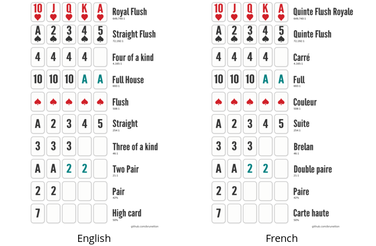

# Poker Pocket hands

Multi-language, simple to understand poker hands combinations

- inspired by [this image](http://i.imgur.com/XlEhEIQ.jpg) found on imgur
- made with [Inkscape](https://inkscape.org)
- using [warsaw-gothic](https://www.fontspace.com/kineticplasma-fonts/warsaw-gothic) font
- **easy** to translate

## Downloads ([PNG](https://en.wikipedia.org/wiki/Portable_Network_Graphics) file format)

- [English](https://github.com/brunetton/poker_poket_hands/blob/master/png/poker%20hands.png)
- [French](https://github.com/brunetton/poker_poket_hands/raw/master/png/poker%20hands%20-%20Fr.png)

### PDF version

You can find PDF versions in [`pdf/`](https://github.com/brunetton/poker_poket_hands/tree/master/pdf) dir. PDF files contains 3 instances on an A4 sheet (for printing).

## Add a new language

For now only English and French are existing. Contribution are **very welcome** !

To add another language:
- edit [`translations.yaml`](https://github.com/brunetton/poker_poket_hands/tree/master/translations.yaml) and add a new language (copy/paste existing French translation and adapt)
- open a terminal and launch `generate_pngs_and_pdf.sh`. Beware that this does not work with snap version of Inkscape (https://gitlab.com/inkscape/inbox/-/issues/7248)

=> Please [**submit a PR**](https://docs.github.com/en/pull-requests/collaborating-with-pull-requests/proposing-changes-to-your-work-with-pull-requests/creating-a-pull-request) (or open a bug if you don't know how to make a PR)

## Contributions

Contributions are welcome (translations, adaptations, etc)

